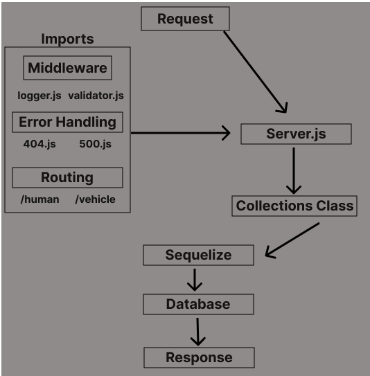

# api-server (LAB 04)

## Project: Template API buildout w/ Classes

### Author: Tyler Bennett

### Problem Domain  

Basic API Server template w/Classes.

### Links and Resources

- [ci/cd](https://github.com/tyler-bennett52/api-server/actions) (GitHub Actions)
- [back-end server url](https://api-server-997g.onrender.com) (when applicable)

### Setup

#### `.env` requirements (where applicable)

DB_URL requires a postgres DB url

#### How to initialize/run your application (where applicable)

- `node index.js`

#### How to use your library (where applicable)

#### Features / Routes

/human - GET & POST human/:id - GET & POST & DELETE
/vehicle - GET & POST vehicle/:id - GET & POST & DELETE

#### Tests

fill this in as you see fit

How do you run tests? npm test

Any tests of note? Test CRUD fucntionality via integration testing

#### UML

#### Attribution

Relied heavily on class demo for Collections class, and much of this lab is identical to lab 03.
